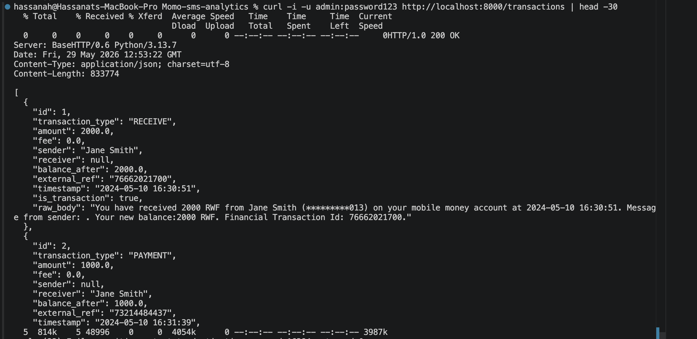
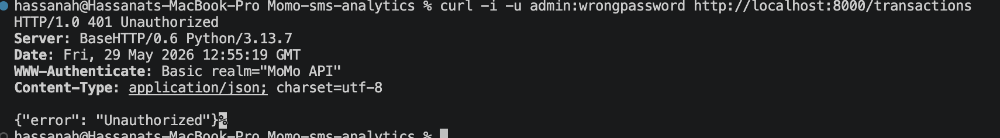
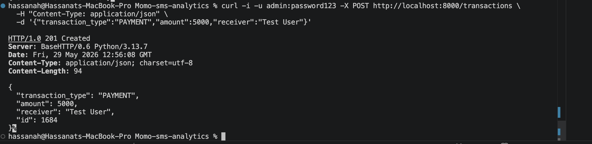
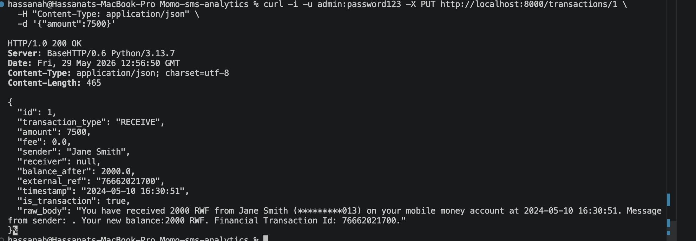
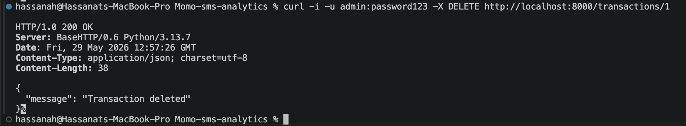

# MoMo SMS Transactions API — Documentation

This API exposes mobile-money SMS records (parsed from `modified_sms_v2.xml`) over HTTP. It is implemented in plain Python using `http.server` and protected with HTTP Basic Authentication.

---

## Base URL

```
http://localhost:8000
```

## Authentication

All endpoints require **HTTP Basic Authentication**. Include the `Authorization` header on every request:

```
Authorization: Basic <base64(username:password)>
```

With `curl`, the `-u` flag handles this automatically:

```bash
curl -u admin:password123 http://localhost:8000/transactions
```

| Field    | Value         |
|----------|---------------|
| Username | `admin`       |
| Password | `password123` |

Requests with a missing, malformed, or invalid `Authorization` header receive `401 Unauthorized` with a `WWW-Authenticate: Basic realm="MoMo API"` header. See the report for why Basic Auth is unsuitable for production and what to use instead (JWT, OAuth2).

---

## Endpoints

### 1. List all transactions

Return every parsed transaction.

| Field   | Value                |
|---------|----------------------|
| Method  | `GET`                |
| Path    | `/transactions`      |
| Auth    | Required             |
| Success | `200 OK`             |

**Request**

```bash
curl -u admin:password123 http://localhost:8000/transactions
```

**Response — `200 OK`**

```json
[
  {
    "id": 1,
    "transaction_type": "RECEIVE",
    "amount": 2000.0,
    "fee": 0.0,
    "sender": "Jane Smith",
    "receiver": null,
    "balance_after": 2000.0,
    "external_ref": "76662021700",
    "timestamp": "2024-05-10 16:30:51"
  },
  {
    "id": 2,
    "transaction_type": "PAYMENT",
    "amount": 1000.0,
    "fee": 0.0,
    "sender": null,
    "receiver": "Jane Smith",
    "balance_after": 1000.0,
    "external_ref": "73214484437",
    "timestamp": "2024-05-10 16:31:39"
  }
]
```

---

### 2. Get one transaction by ID

Return a single transaction by its numeric `id`.

| Field   | Value                       |
|---------|-----------------------------|
| Method  | `GET`                       |
| Path    | `/transactions/{id}`        |
| Auth    | Required                    |
| Success | `200 OK`                    |

**Request**

```bash
curl -u admin:password123 http://localhost:8000/transactions/1
```

**Response — `200 OK`**

```json
{
  "id": 1,
  "transaction_type": "RECEIVE",
  "amount": 2000.0,
  "fee": 0.0,
  "sender": "Jane Smith",
  "receiver": null,
  "balance_after": 2000.0,
  "external_ref": "76662021700",
  "timestamp": "2024-05-10 16:30:51"
}
```

---

### 3. Create a new transaction

Add a new transaction to the in-memory store.

| Field   | Value                                |
|---------|--------------------------------------|
| Method  | `POST`                               |
| Path    | `/transactions`                      |
| Auth    | Required                             |
| Body    | `application/json`                   |
| Success | `201 Created`                        |

**Request**

```bash
curl -u admin:password123 -X POST http://localhost:8000/transactions \
  -H "Content-Type: application/json" \
  -d '{
    "transaction_type": "PAYMENT",
    "amount": 5000,
    "sender": null,
    "receiver": "Test User",
    "fee": 0,
    "balance_after": 12000
  }'
```

**Required body fields:** `transaction_type`, `amount`, `receiver` (or `sender`, depending on type).
**Optional:** `fee`, `balance_after`, `external_ref`, `timestamp`. The server assigns `id` automatically.

**Response — `201 Created`**

```json
{
  "id": 1694,
  "transaction_type": "PAYMENT",
  "amount": 5000.0,
  "sender": null,
  "receiver": "Test User",
  "fee": 0.0,
  "balance_after": 12000.0,
  "external_ref": null,
  "timestamp": "2026-05-29T12:43:32+00:00"
}
```

---

### 4. Update an existing transaction

Update fields on an existing transaction. Only provided fields are changed; omitted fields keep their current value.

| Field   | Value                       |
|---------|-----------------------------|
| Method  | `PUT`                       |
| Path    | `/transactions/{id}`        |
| Auth    | Required                    |
| Body    | `application/json`          |
| Success | `200 OK`                    |

**Request**

```bash
curl -u admin:password123 -X PUT http://localhost:8000/transactions/1 \
  -H "Content-Type: application/json" \
  -d '{"amount": 7500, "receiver": "Updated Name"}'
```

**Response — `200 OK`**

```json
{
  "id": 1,
  "transaction_type": "RECEIVE",
  "amount": 7500.0,
  "sender": "Jane Smith",
  "receiver": "Updated Name",
  "fee": 0.0,
  "balance_after": 2000.0,
  "external_ref": "76662021700",
  "timestamp": "2024-05-10 16:30:51"
}
```

---

### 5. Delete a transaction

Remove a transaction by `id`.

| Field   | Value                       |
|---------|-----------------------------|
| Method  | `DELETE`                    |
| Path    | `/transactions/{id}`        |
| Auth    | Required                    |
| Success | `200 OK`                    |

**Request**

```bash
curl -u admin:password123 -X DELETE http://localhost:8000/transactions/1
```

**Response — `200 OK`**

```json
{ "message": "Transaction 1 deleted" }
```

---

## Error Codes

| Code | Meaning                  | When it    happens                                                                             |
|------|--------------------------|--------------------------------------------------------------------------------------------|
| 200  | OK                       | Successful `GET`, `PUT`, or `DELETE`.                                                      |
| 201  | Created                  | Successful `POST` — new transaction added.                                                 |
| 400  | Bad Request              | Request body is missing, not valid JSON, or missing required fields.                       |
| 401  | Unauthorized             | `Authorization` header missing, malformed, or credentials invalid.                         |
| 404  | Not Found                | `id` does not exist (on `GET /transactions/{id}`, `PUT`, or `DELETE`), or path is unknown. |
| 405  | Method Not Allowed       | HTTP method not supported on that path (e.g. `PATCH /transactions`).                       |
| 500  | Internal Server Error    | Unexpected server-side failure.                                                            |

### Error response shape

All errors return a JSON body of the form:

```json
{ "error": "Human-readable description" }
```

**Example — `401 Unauthorized`:**

```http
HTTP/1.0 401 Unauthorized
WWW-Authenticate: Basic realm="MoMo API"
Content-Type: application/json

{ "error": "Unauthorized" }
```

**Example — `404 Not Found`:**

```http
HTTP/1.0 404 Not Found
Content-Type: application/json

{ "error": "Transaction not found" }
```

**Example — `400 Bad Request`:**

```http
HTTP/1.0 400 Bad Request
Content-Type: application/json

{ "error": "Invalid JSON body" }
```

---

## Testing & Validation

Each endpoint was tested with `curl` against the running API. Screenshots below show the command, the response headers (including HTTP status code), and the response body.

### 1. Successful GET with authentication

Valid credentials, list endpoint returns `200 OK` with the transactions array.



### 2. Unauthorized request — wrong credentials

Invalid password is rejected with `401 Unauthorized` and a `WWW-Authenticate` header.



### 3. Successful POST — create transaction

Valid `POST` body creates a new transaction; server returns `201 Created` with the assigned `id`.



### 4. Successful PUT — update transaction

Valid `PUT` updates fields on an existing transaction; server returns `200 OK` with the updated record.



### 5. Successful DELETE — remove transaction

Valid `DELETE` removes the record; server returns `200 OK`.



---

## Notes

- Data is held in memory and reloaded from `modified_sms_v2.xml` on server start. Changes from `POST`, `PUT`, and `DELETE` persist only for the lifetime of the server process.
- All timestamps in responses follow ISO 8601 where generated by the server; original SMS timestamps are preserved in their original `YYYY-MM-DD HH:MM:SS` form as parsed from the message body.
- See `screenshots/` for full-resolution test evidence and `dsa/benchmark_results.md` for search efficiency comparison results.